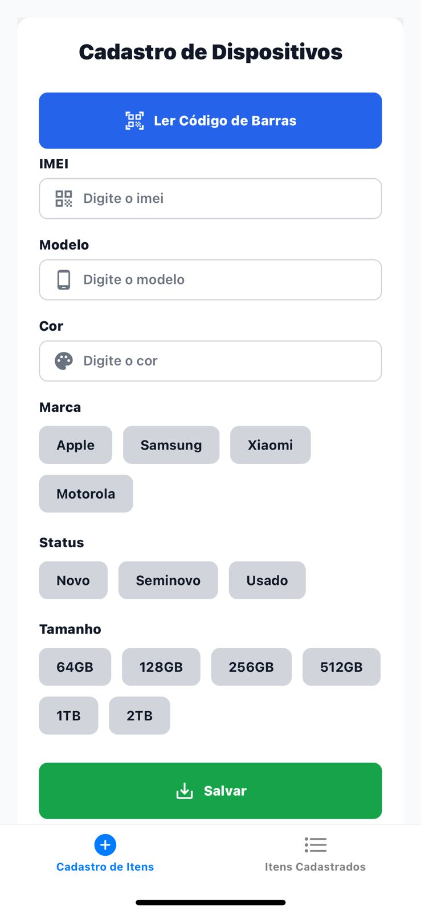
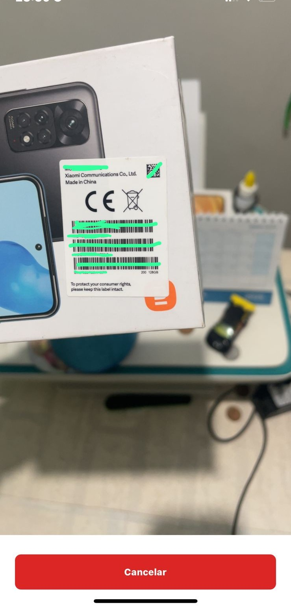
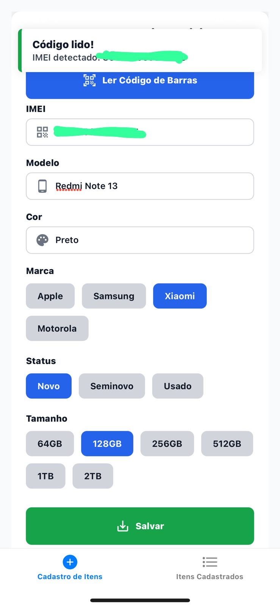
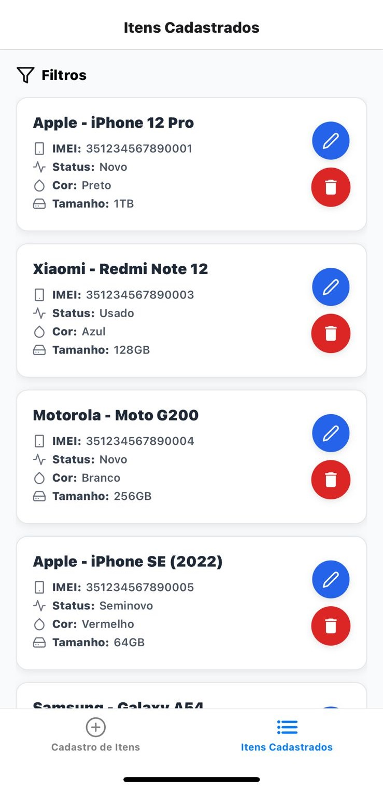
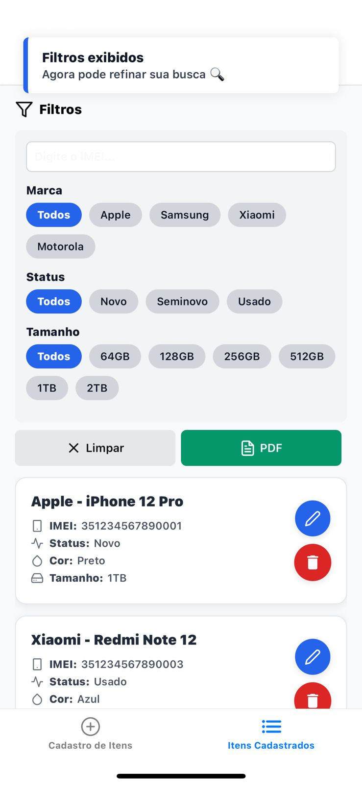
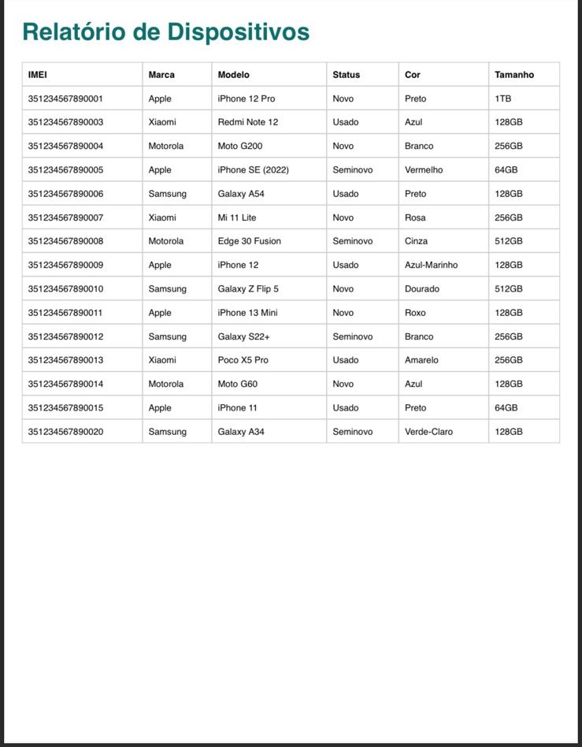

# Gerenciador de Dispositivos - MVP

[](https://reactnative.dev/)
[](https://expo.dev/)
[](https://www.typescriptlang.org/)
[](https://www.sqlite.org/index.html)

------------------------------------------------------------------------

## 📖 Sobre o Projeto

O **Gerenciador de Dispositivos** é um aplicativo desenvolvido como **MVP (Minimum Viable Product)** para gerenciamento de estoque de dispositivos (smartphones).  
Ele permite cadastrar, editar, remover, filtrar e exportar relatórios de dispositivos em **PDF**, servindo como prova de conceito para validar a ideia.

------------------------------------------------------------------------

## 🚀 Tecnologias Utilizadas

### Frontend

-   *React Native + Expo + TypeScript*
-   *SQLite* como banco de dados local
-   *Expo Router* para navegação
-   *Expo Camera* para captura de imagens e leitura de QR Codes/IMEI
-   *PDF Export (Expo Print & Sharing)* exportação de conteúdos em PDF
-   Hooks e Context API para gerenciamento de estado


### Backend (futuras evoluções)

-   Integração com API externa
-   Autenticação de usuários
-   Sincronização com banco remoto

------------------------------------------------------------------------

## 📂 Estrutura do Projeto

    GestaoEstoque-Celulares/
    │── app/                    # Arquivos principais do Expo Router / telas
    │── assets/                 # Recursos estáticos (ícones, imagens)
    │── colors/                 # Paleta de cores global
    │── components/             # Componentes reutilizáveis
    │   ├── Buttons/            # Botões customizados
    │   ├── Cards/              # Cards de dispositivos
    │   └── Filters/            # Filtros (Box e Chips)
    │── constants/              # Constantes globais
    │── context/                # Context API
    │── database/               # Métodos SQLite
    │── hooks/                  # Hooks customizados (useDevices, useDeviceFilters)
    │── scripts/                # Scripts auxiliares
    │── types/                  # Tipos TypeScript (ex: Device)
    │── utils/                  # Utilitários (ex: geração de PDF)
    │── .gitignore
    │── app.json
    │── package.json
    │── tsconfig.json
    │── README.md

------------------------------------------------------------------------

## ⚙ Funcionalidades

✅ Cadastro de dispositivos (IMEI, marca, modelo, status, cor, tamanho)\
✅ Edição e exclusão de dispositivos\
✅ Busca por IMEI\
✅ Filtros dinâmicos (marca, status, tamanho)\
✅ Exportação da lista para PDF\
✅ Feedback ao usuário com **toasts**\
✅ Interface simples e responsiva

------------------------------------------------------------------------

## 📸 Screenshots


### ✏️ Cadastro
<p align="center">



</p>

### 📋 Listagem de Dispositivos
<p align="center">
  
  
</p>


### 📄 Exportação em PDF
<p align="center">
  
</p>

------------------------------------------------------------------------

## 📦 Instalação

### Passo 1 - Clonar o repositório
```bash
git clone https://github.com/JoaoLemes18/GestaoEstoque-Celulares.git
```

### Passo 2 - Instalar dependências
```bash
cd device-manager-mvp
npm install
```

### Passo 3 - Executar o projeto
```bash
npx expo start
```

------------------------------------------------------------------------

## 🎯 Objetivo do MVP

Este projeto tem como objetivo validar a ideia de um sistema de **gestão de dispositivos**.  
Por ser um MVP, ele foca apenas no essencial:

1. **Cadastro**  
2. **Listagem com filtros**  
3. **Exportação em PDF**

Próximos passos planejados:
- 🔒 Autenticação de usuários  
- ☁️ Sincronização em nuvem  
- 📊 Dashboards com relatórios  
- 🌐 Suporte Web + Mobile  

------------------------------------------------------------------------

## 🤝 Contribuição

Sugestões e melhorias são bem-vindas!\
Abra uma *issue* ou envie um *pull request*.

------------------------------------------------------------------------

## 📄 Licença

Este projeto foi desenvolvido como **MVP (Minimum Viable Product)** e está licenciado sob a [MIT License](./LICENSE.md).  
Sinta-se à vontade para utilizar, modificar e compartilhar, dando os devidos créditos. 🚀
